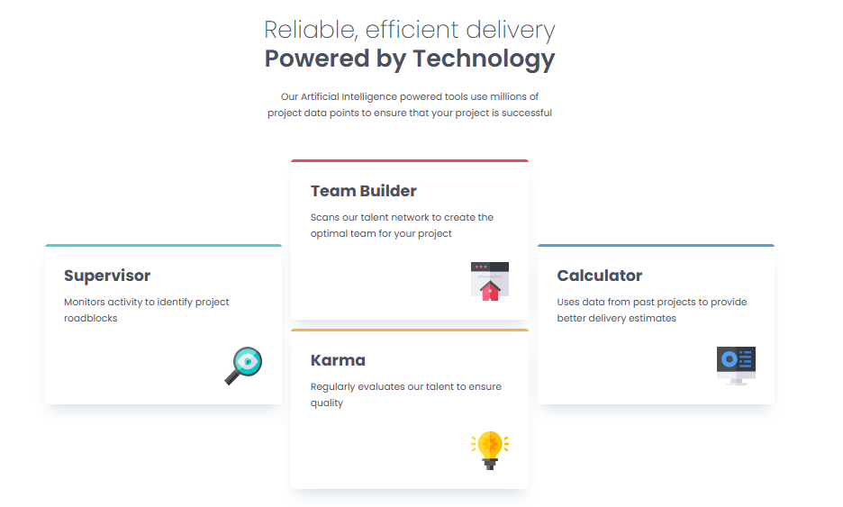

# Frontend Mentor - Four card feature section solution

This is a solution to the [Four card feature section challenge on Frontend Mentor](https://www.frontendmentor.io/challenges/four-card-feature-section-weK1eFYK). Frontend Mentor challenges help you improve your coding skills by building realistic projects.

## Table of contents

- [Overview](#overview)
  - [The challenge](#the-challenge)
  - [Screenshot](#screenshot)
  - [Links](#links)
- [My process](#my-process)
  - [Built with](#built-with)
  - [What I learned](#what-i-learned)
  - [Continued development](#continued-development)
- [Author](#author)

## Overview

### The challenge

Users should be able to:

- View the optimal layout for the site depending on their device's screen size

### Screenshot



### Links

- Solution URL: [https://github.com/wamaedev/four-card-feature](https://github.com/wamaedev/four-card-feature)
- Live Site URL: [https://wamaedev.github.io/four-card-feature-/](https://wamaedev.github.io/four-card-feature-/)

## My process

### Built with

- Semantic HTML5 markup
- CSS custom properties (CSS variables)
- Flexbox
- CSS Grid
- Mobile-first workflow
- Google Fonts (Poppins)

### What I learned

This project helped reinforce my understanding of CSS Grid for creating responsive layouts. I implemented a three-column layout on desktop that gracefully stacks on mobile devices. 

Key CSS techniques I used:

```css
.layout-grid {
  --gap: 1rem;
  display: grid;
  gap: var(--gap);
}

@media (min-width: 800px) {
  .layout-grid {
    grid-template-columns: 1fr 1fr 1fr;
  }
}
```
I also utilized CSS custom properties (variables) to maintain consistent colors, typography, and spacing throughout the project:
```css
:root {
  --ff-sans: 'Poppins', sans-serif;
  --fw-light: 200;
  --fw-normal: 400;
  --fw-bold: 600;
  --clr-teal: hsl(180, 58%, 56%);
  --clr-red: hsl(0, 70%, 60%);
  --clr-blue: hsl(212, 75%, 62%);
  --clr-yellow: hsl(34, 89%, 65%);
}
```
The card component uses a colored border-top to indicate different feature categories, which was achieved with modifier classes:
```css
.card {
  border-top: var(--br) solid;
}

.border-teal {
  border-color: var(--clr-teal);
}
.border-red {
  border-color: var(--clr-red);
}
/* ... */
```

### Continued development

- In future projects, I want to focus on:

- Implementing more complex responsive layouts

- Exploring CSS Grid advanced features like grid-template-areas

- Improving accessibility with ARIA labels and semantic HTML

- Adding smooth animations and transitions

## Author

Frontend Mentor - @wamaedev


## Acknowledgments

This README accurately reflects your project's:
- Use of CSS Grid for responsive layout
- CSS custom properties for consistent theming
- Mobile-first approach
- Component-based styling with modifier classes
- Google Fonts integration (Poppins)
- Semantic HTML structure with header, main, and proper heading hierarchy
